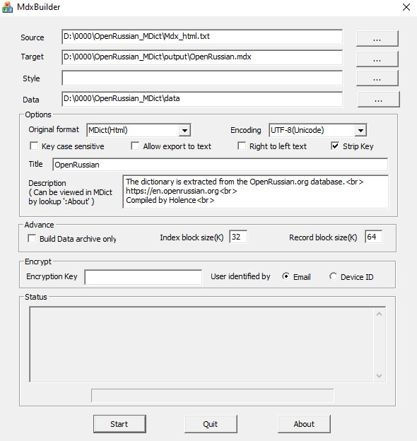
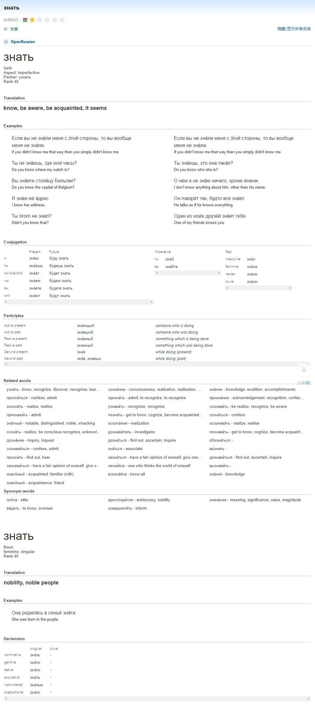
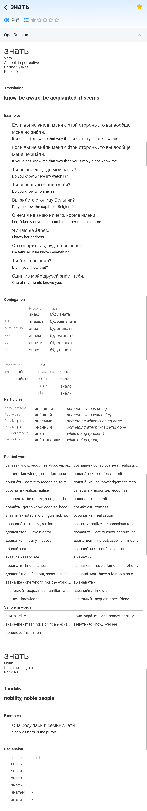

# OpenRussian_MDict

Convert OpenRussian.org CSVs to mdx

# Building

1. Get CSVs from OpenRussian.org [Database](https://app.togetherdb.com/db/fwoedz5fvtwvq03v/russian3), put them in folder "russian3" and rename them (removing the "russian3 - " part).

2. From CSVs to dict.json (generate_dict.py \ generate_dict.ipynb)

3. From dict.json to Mdx_html.txt (generate_html.py)

4. Append other word forms (linking to bare form) using "@@@LINK=" (add_links.py)

5. MdxBuilder

   

# Screenshots

PC

Android

# Links

- [OpenRussian](https://en.openrussian.org/) - [Database](https://app.togetherdb.com/db/fwoedz5fvtwvq03v/russian3)
- [MdxBuilder v3.0](https://www.pdawiki.com/forum/thread-42526-1-1.html)

# Licenses

Shield: [![CC BY-SA 4.0][cc-by-sa-shield]][cc-by-sa]

This work is licensed under a
[Creative Commons Attribution-ShareAlike 4.0 International License][cc-by-sa].

[![CC BY-SA 4.0][cc-by-sa-image]][cc-by-sa]

[cc-by-sa]: http://creativecommons.org/licenses/by-sa/4.0/
[cc-by-sa-image]: https://licensebuttons.net/l/by-sa/4.0/88x31.png
[cc-by-sa-shield]: https://img.shields.io/badge/License-CC%20BY--SA%204.0-lightgrey.svg
